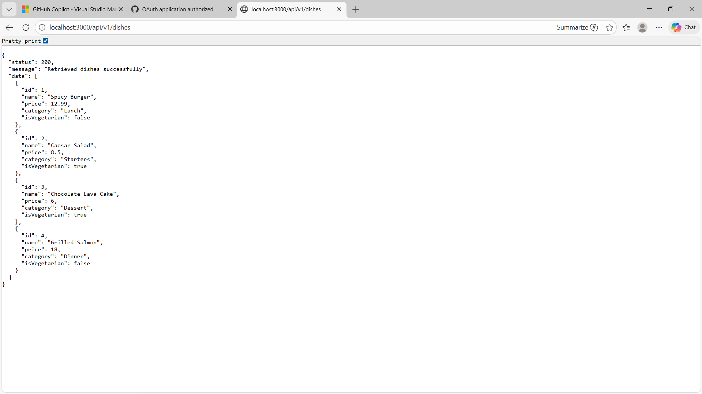

# RESTful API Activity - [Marc Reiven Macaraig]

## ✅ Best Practices Implementation

### 1. Environment Variables
**Q:** Why put `BASE_URI` in `.env` instead of hardcoding it?  
**Answer:** It lets us change settings for different environments (dev, test, prod) without changing the code. This makes the app easier to manage and deploy.

---

### 2. Resource Modeling
**Q:** Why use plural names like `/dishes`?  
**Answer:** Plural names follow REST standards and clearly represent a collection of items. This makes the API easier to understand and use.

---

### 3. Status Codes
**Q:** When should we use `201 Created` vs `200 OK`?  
**Answer:**  
- Use **`201 Created`** when a new resource is successfully created.  
- Use **`200 OK`** when a request succeeds, such as fetching or updating data.

**Q:** Why return `404 Not Found` instead of an empty result?  
**Answer:**  
- **`404 Not Found`** means the requested item does not exist.  
- **`200 OK` with an empty array** means the request was valid, but there is no data to return.  
Using the correct status code helps clients understand what really happened.

---

### 4. Testing

